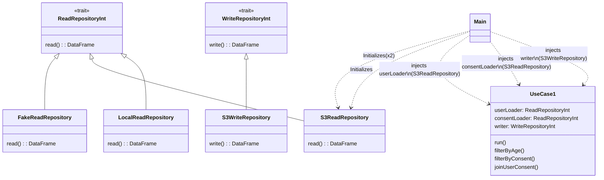

# spark-app

Spark Application example with Clean Architecture.

## Requirements

- Maven > 3.9
- JVM 8. (Tested with Corretto-8.362.08.1)
- Docker (Only needed run integration-tests)

## Description

This is an example Spark Application that can be used as a Template.

It abstracts the business logic from the input/output using the Dependency Inversion Principle
allowing to inject the dependencies to your business logic from the Main method.

### Class Diagram



### Sequence Diagram


## Build and test

To compile the project run: `mvn clean compile`

To execute Unit tests run: `mvn test`

Create the package: `mvn package`

To execute Integration tests:
- Start Docker daemon or Docker Desktop
- Run `mvn test -Pintegration-test`

## Run the application

Local execution:
```bash
mvn package
java -cp target/scala-app-1.0-SNAPSHOT-jar-with-dependencies.jar com.gopetracca.App
```

Spark cluster execution:
```bash
$SPARK_HOME/bin/spark-submit --master="local[2]" --class=com.gopetracca.App target/scala-app-1.0-SNAPSHOT.jar
```

## TODO
- Configuration module
